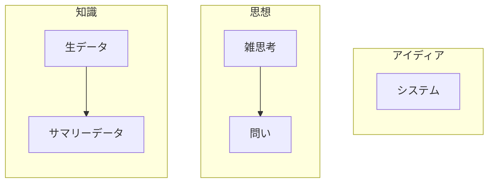

### そろそろ整理をする

### 思想
- 思考は一度忘れて、ランダムに再度思い出す、を繰り返した方が良い。
  なので、全体を整理することに注力しすぎるのは、得策ではないかもしれない。
  → ランダム表示するのはgitと親和性がないため、.gitignoreのファイルなどで実現を試みる。

### topics
- topics
	- **未分類**
		- 知識/思想/アイディア	knowledge/thought/idea
			- 知識
				- ＊＊は＊＊である
				- ＊＊の種類と特徴
				- 入力生データ
				- サマリーデータ
			- 思想
				- ＊＊は＊＊であるはずだ
				- 問い
					- なぜ＊＊は＊＊なのか
			- アイディア
				- ＊＊＊するシステム
		- モールス信号	: morls-signal/
		- サービスイメージ
			- 自分の体の症状を伝えるとイメージ画像を生成してくれるAI
			- ランダムドクター	自分の体の症状を置いておくとAIがランダムにドクターに診断依頼を出す
	- テニス
		- [x] jta-rule : jta-rule/
		- ATPツアーグレード
	- youtube
		- ゆるコン
			- [x] パスキー : yuru-passkey/
			- [x] 二分探索木 : yuru-binary_search_tree/
		- プテカイ
			- [x] 意見コメント1 : putekai/
			- フェデラーのクラッチ力の回
				- 内容の構成理解
				- 不満点
	- [x] github構造構想 : github-scheme/
	- 車選び
		- cx80
		- 経済性計算機
			- 燃費
			- リセール
	- やるき
		- todoは未来のものを見せない
	- 構造化
		- 調達業務 と サブ関数呼び出し
	- 心療
		- 発達障害
			- ASD
			- ADHD
			- LD
		- 鬱
			- うつ病
			- 適応障害
		- ビジュアルシンカー
	- IT
		- プロジェクトマネジメント
			- スタイル
				- waterfall
				- agile
			- WBS
		- 製造
		- プログラミング言語
			- backend
				- python
				- C
				- C++
				- Rust
				- FortRan
				- Kotolin
				- GO
				- java
			- flontend
				- javascript
				- html
				- css
				- typescript
	- AI
		- 種類
			- ChatGPT/Claude/Gemini...
		- 構造
			- モデルとか学習とか
		- 利用体系/料金体系
			- GithubCopilot
			- Continue
	- 資格
		- 基本情報技術者
		- 応用情報技術者
		- DB系
		- Azure系
		- AWS系
	- 雑学
		- 車
			- [x] タイヤのサイズ表記 : car-tire/
