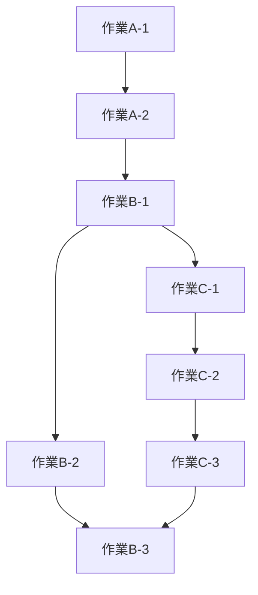
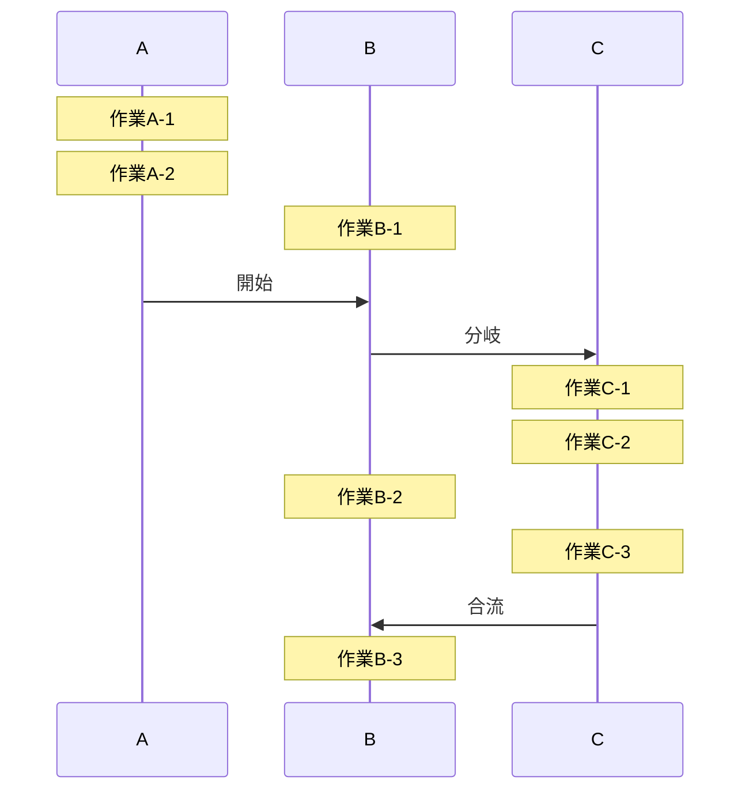

# イメージ
gitグラフを上から下に流すイメージ
*   作業A-1
*   作業A-2

*   作業B-1
|*  作業C-1
|*  作業C-2
*|  作業B-2
|*  作業C-3
*   作業B-3

というように一連の流れをつなぐ線を箇条書きの左側に書く記法がないだろうか。

# 記法の検討
Claudeはいい記法は今の所ないと言っている。
## git的イメージ
/|\

## mermaid
### flowchart
いまいち

### sequenceDiagram
いまいち


# 実現性の検討
## taskflow - vscode : VSCode拡張機能を作るとしたら の仕様
AIに造らせた仕様のため、イメージと若干異なる点は、気が向いたら手動で更新。
### コンセプト

並列に進む複数の作業ストリームを、縦線付きのビューで可視化・管理するVSCode拡張。  
「バッと書いて、従って、入れ替えて、説明に使える」手軽さが最重要。

---

### ファイル形式（`.taskflow`）

テキストベースで保存する独自形式。gitで差分管理できる。

#### 基本構造

```
stream: A 発注処理
---
作業A-1
作業A-2
---
作業A-3
作業A-4

stream: B 問い合わせ対応
---
作業B-1
---
作業B-2
作業B-3

stream: C レポート作成
---
---
作業C-1
作業C-2
```

#### `---` ルール

- `---` より**上**：完了済み
- `---` より**下**：未実施
- `opt+↓` で `---` 行を1つ下に移動 → 直感的に完了処理できる
- ストリームの先頭に `---` が2行連続 → 全タスク未着手

---

### ビュー

`.taskflow` ファイルを開くと、エディタ横にカスタムパネルが表示される（WebviewAPI使用）。

#### イメージ

```
│ A 発注処理          │ B 問い合わせ対応    │ C レポート作成
│                     │                     │
│ ✓ 作業A-1           │ ✓ 作業B-1           │
│ ✓ 作業A-2           ├─────────────────    │
├─────────────────    │ → 作業B-2           │
│ → 作業A-3           │   作業B-3           │ → 作業C-1
│   作業A-4           │                     │   作業C-2
```

- 各ストリームは縦線で区切られた列として表示
- `✓` 完了済み（`---` より上）
- `→` 現在の先頭タスク（`---` のすぐ下）
- 完了済みはグレーアウト

---

### キー操作

| 操作 | 動作 |
|------|------|
| `↑` / `↓` | カーソル移動 |
| `opt+↑` / `opt+↓` | タスクを同ストリーム内で並び替え |
| `opt+↓`（`---`行にカーソル） | `---` を1つ下へ → 完了処理 |
| `shift+enter` | 現在行の下に新規タスク追加 |
| ドラッグ | タスクをストリーム間・行間で移動 |
| `cmd+enter` | ストリームを新規追加 |

---

### テンプレート機能

定例作業をテンプレートとして保存・呼び出せる。

```
~/.taskflow/templates/
  weekly-report.taskflow
  incident-response.taskflow
  onboarding.taskflow
```

新規ファイル作成時にテンプレ選択 → コピーして作業開始。  
gitで履歴管理できるのでテンプレ自体のバージョン管理も可能。

---

### 将来拡張（アイデアメモ）

- **依存関係の表示**：`A-3 depends: B-2` のような記法で、待ち状態のタスクをグレーアウト
- **時間見積もり**：`作業A-3 [30m]` のような記法
- **進捗の共有**：現在のビューをMarkdownやテキストとしてクリップボードにコピー

---

### 技術メモ

- VSCode WebviewAPI でカスタムビューを実装
- データはテキスト（`.taskflow`）として保存 → git管理可能
- キーバインドはVSCode標準のkeybindings.jsonで設定
- 実装言語：TypeScript（VSCode拡張の標準）

---

*このドキュメントはアイデア段階の仕様メモです。*

eof
