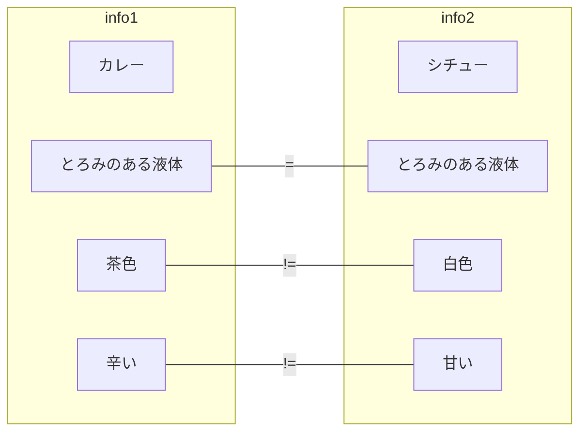

## 概要
ものを考える、ということは、すべて
２つのものを並べ、その間の関係を考えることだ、と捉えられるのではないか、
という考えから、
イメージ図を考えてみる。
## image
- 情報１
- 情報２
- 関連 : 関連には、主に比較演算子が使用できると思う。
    - = , !=  一致 , 不一致
    - > , <=  大小
    - ⊂ 含まれる (これはキーボード入力が出しにくい)
    - ...など

## mermaid

## issue
- あまり書きやすくない
    たんにvscodeのcompareを使用するアイディアも

    本質的には、２つの情報とそれらの間の関係性というモデルは本質をついていると思う。
